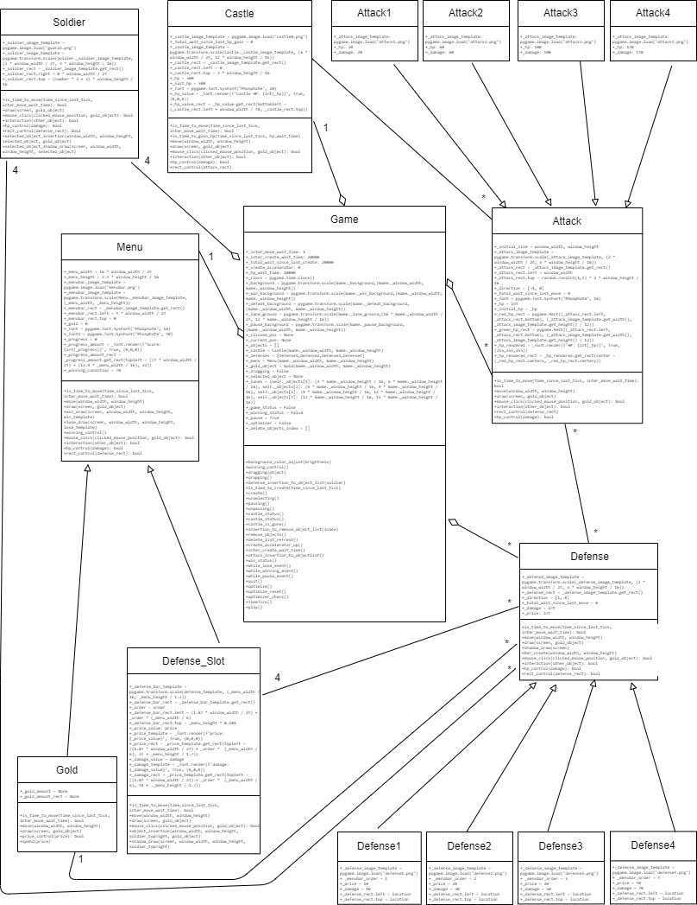
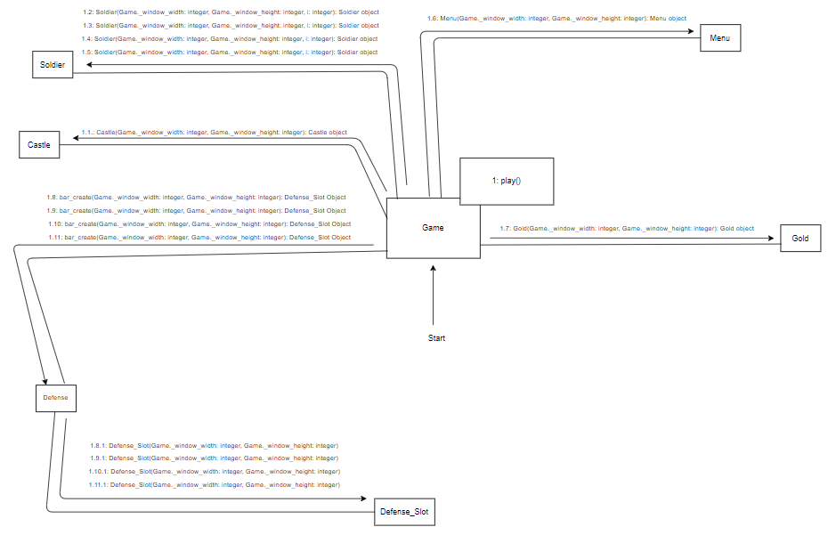
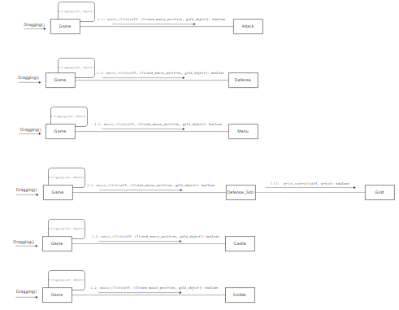
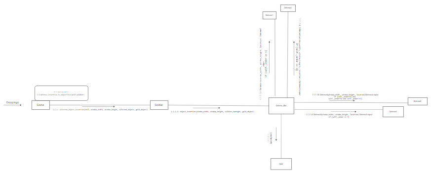
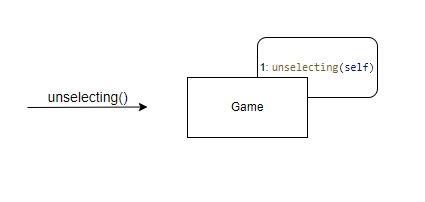
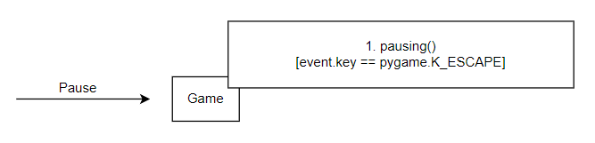
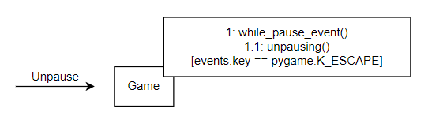
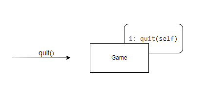
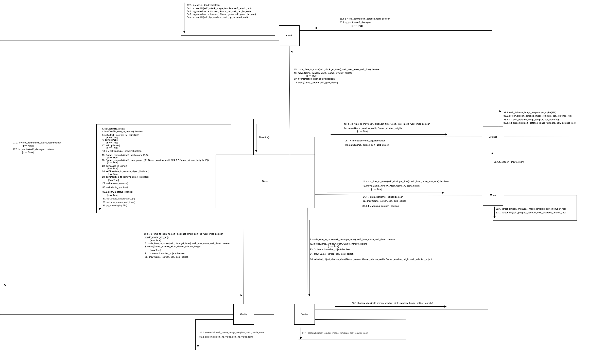

09.06.2022

**IE201 PROJECT PART 3 GROUP - 3**

**DEFEND THE CASTLE**

**Instructor:** Ali Tamer Ünal

**Group 3 Members:**

Ahmet Selim Gül - 2020402246 

Enver Eren - 2019402189

Esra Atlı - 2019402030

**Table of Contents**

Brief Description of the Game

Class Diagram

Explanation of the Class Diagrams

Use Case Diagram

Explanation of the Use Case Diagram 

Collaboration Diagrams and Explanations 

**Brief Description of the Game**

In this game, we have 4 identical soldiers trying to defend the castle. There are 4 lanes on which each of these 4 soldiers stay stationary. We also have 4 different types of attacks with different damage power coming randomly from these lanes with an increasing creation speed. We have 4 different types of defenses, each having a different damage against attacks. Once a defense is used against an attack, it either reduces the damage of the attack or completely destroys it depending on the damage powers of both items. There is a menu bar on the screen from which the player can drag and drop defense on a soldier. A defense can only be used once for every drag-and-drop. If the player wants to use a defense again, she should drag-and-drop that defense once more. That is, soldiers shoot when a defense is dragged and dropped on them, and once they shoot, they become inactive again, until a defense is dragged and dropped on them once more. There are also game gold and score in the menu bar. Game gold is spent for using defense, and every defense has a specific number of game-golds-needed to be used. Game gold regularly increases in specific time intervals. Score indicates how long the castle is defended against attacks. Moreover, there are 500 hit points assigned to the castle. If the castle doesn’t get hit for 10 seconds, hit points increase by 10. When an attack hits the castle, hit points decrease. The game eventually ends when the hit points become 0 or score becomes 40.

**Class Diagram**

**Explanation of the Class Diagrams:**

Game: Main class that runs the game loop. All other classes are connected to Game.

Menu: Menu shows the current score and amount of gold. Defense types are chosen from menu. Soldier: Soldiers that protect the castle.

Attack: Attackers of the castle.

Defense: Equipment used by soldiers against attacks.

Castle: The object that should be protected against attacks. It has a certain hp.

**Class Relations:**

Game-Menu: Aggregation relation. Cardinality is one to one, there is one menu in the game.

Game – Soldier: Aggregation relation. Cardinality is one to four, there are four soldiers in the game.

Game – Attack: Aggregation relation. Cardinality is one to many, many attacks are created in the game to attack the castle.

Game – Defense: Aggregation relation. Cardinality is one to many, many defenses are created in the game to protect the castle against attacks.

Game – Castle: Aggregation relation. Cardinality is one to one, there is one castle in the game.

Menu – Defense\_Slot: Inheritance relation. Menu is the parent class, Defense\_Slot is the child class.

Menu – Gold: Inheritance relation. Menu is the parent class, Gold is the child class.

Soldier – Defense: Association relation. Cardinality is four to many. A soldier can use many defenses and a defense can be used by four guards.

Castle – Attack: Association relation. Cardinality is one to many. The castle can be attacked by many attacks and an attack can attack the castle.

Attack – Defense: Association relation. Cardinality is many to many. Many attacks can associate with defenses and vice versa.

Defense – Defense\_Slot: Association relation. Cardinality is many to four, many defenses are used in the slots and there are 4 slots.

Defense – Gold: Association relation. Cardinality is many to one, many defenses are used with gold and there is one gold.

Defense - Defense1, Defense2, Defense3, Defense4: Inheritance relation. Defense is the parent class, others are child classes.

Attack – Attack1, Attack2, Attack3, Attack4: Inheritence relation. Attack is the parent class, others are child classes.

**Use Case Diagram**

**Explanation of the Use Case Diagram**

- **Start**: By starting the game, the frame is started. Some objects such as castles and soldiers are created. Also, enemies are created at some intervals determined by parameters.
- **Pause**: This case makes the game “paused”. Each object and theme stop at a certain state.
- **Unpause**: This case makes the game “unpaused”. Game continues.
- **Drag**: From the toolbar above the screen, the player can choose a defense type according to the coming enemy. Each defense has a specific price to purchase.
- **Drop**: After choosing a defense, the player would choose a lane to drop the selected defense.
- **Unselect**: After choosing a defense, the player would choose to unselect the defense.
- **Exit**: Player can exit the game using the “exit” case. Each created object and theme is canceled after exiting.
- **Time.tick()**: Computer use this case at the end of each loop (main frame). According to the clicked time, events such as enemy creation or an increase in the amount of gold are created and maintained.

**Collaboration Diagrams and Explanations**

**Collaboration Diagram of Start:**

When the game is started, 1 instance of Castle, 4 instances of Soldier, 1 instance of Menu, and 1 instance of Gold are created. Then, Game calls the bar\_create() function in Defense and 4 instances of Defense\_Slot are created.

**Collaboration Diagram of Drag:**

Game first calls the dragging(object) function within itself, and then calls mouse\_click(clicked\_mouse\_position, gold\_object) from the classes Attack, Defense, Menu, Defense\_Slot, Castle, and Soldier. If the object belongs to the class Defense\_Slot, Defense\_Slot calls price\_control(price) from Gold so that the mouse\_click function can return the desired outcome. If the object does not belong to the Defense\_Slot, then mouse\_click(clicked\_mouse\_position, gold\_object) returns False.

**Collaboration Diagram of Drop:**

Game first calls the dropping() function and then defense\_insertion\_to\_objectlist(self,soldier) within itself. selected\_object\_insertion(window\_width, window\_height, selected\_object, gold\_object) is called from Soldier. Then, Soldier calls object\_insertion(self, window\_width, window\_height, soldier\_topright, gold\_object) from Defense\_Slot with given parameters. Defense\_Slot calls spend(price) from Gold to decrease the gold used in dropping. According to self.\_order value, Defense\_Slot creates one of the class objects from the classes Defense1, Defense2, Defense3, Defense4.

**Collaboration Diagram of Unselect:**

Game calls the unselecting() function from itself. So, self.\_dragging becomes False.

**Collaboration Diagram of Pause:**

Game calls the pausing() function within itself to pause the game.

**Collaboration Diagram of Unpause:**

Game calls unpausing() function within itself to unpause the game.

**Collaboration Diagram of Exit:**

Game calls quit() function within itself and the game is quitted with a builtin function.

**Collaboration Diagram of Time.tick():**

Time.tick() use case which is executed per frame by the computer.

Time is traced by game. The big part of the main frame of the game is run according to the time interval that is kept by time tick. As seen above, after the play function is called, time.tick() is executed by the computer as a use case for each loop.

Time.tick() is main controller for the following functions “is\_time\_to\_create(), create(), is\_time\_to\_move(), move(), blit(), interaction(), castle\_is\_gone(), remove\_object(), draw(), flip()”. All of the functions are called(conditionally) at certain times (at each frame).

Is\_time\_to\_create() is a function that returns a boolean according to whether the creation time of attack objects has come or not. Then, if the time comes, the create() function is executed and a random attack object is created.

Is\_time\_to\_move() is a function that returns a boolean according to whether the move time of objects has come or not. Then, if the time comes, the move() function is executed and objects move.

Blit() function is called for the background image before drawing other objects.

Then, the interaction() function is called for each interactive object in self.\_objects: list. Castle\_is\_gone(), remove\_object(), and draw() functions are called conditionally as a following of interaction().

Then the whole drawn figures are flipped by using flip() function.

All the processes and functions above are executed at certain time intervals. The time intervals are kept by time.tick().

